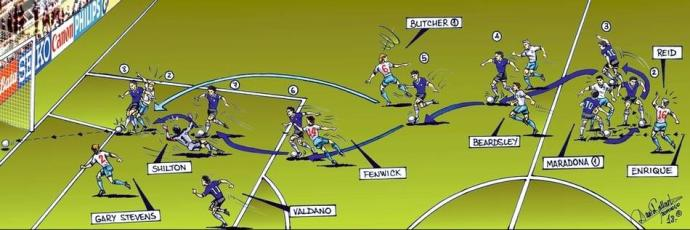

# LOS DIEGUITES

## 					Instrucciones 

 
 
Sos el Diego en el 86, estas solo en un cancha frente a distintos rivales. Tu objetivo es ir esquivando a todos los rivales hasta superar los 3000 puntos y asi lograr meterle un gol a Peter Shilton. 
 
*Si te quedas sin vidas perdes.*
* **Movimiento**: Flechas de dirección (W, A , S , D).
* **Patear pelota**: Espacio. (Un disparo de gol = -1 de vida)

### Rivales
  *  **Mas cantidad**: Si no logras esquivar a un aleman restas 1 de vida.
  *  **Mas rapidos**: Si no logras esquivar a un brasilera restas 2 de vida.
  *  **Mas daño**: Si no logras esquivar a un ingles restas 3 de vida.
 
 
 ### Defensa
  *Te permiten ser un diego patriota y vestirse de argentino:*
  
  *    **Argentina**: Si logras agarrar una bandera argentina podes chocar contra cualquier rival sin perder vida. 
 
  ### Vidas
  *Podes acumular tantas vidas como puedas conseguir:*
  
  *    **Pelota**: Logra agarrar la mayor cantidad de vidas que puedas! 
 
  ### Final
  *Luego de superar los 3000 puntos:*
  
  *    **Patear**: Podras intentar hacerle un gol como tantas pelotas dispongas al momento de superar los 3000 puntos.

## Autores ✒️
* Gagliardo,Matias
* Mota, Jonathan
* Jarne Ferrarotti, Patricio
